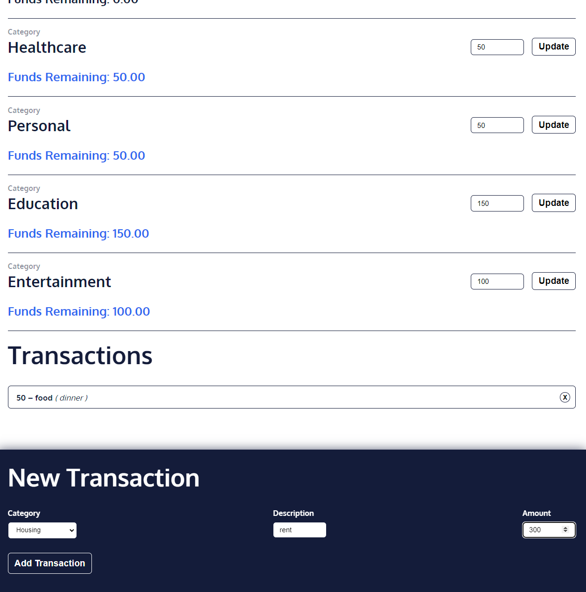

# Expense Tracker💸

## General Info
**Expense Tracker App, built with React and Redux. 
The app allows you to set budgets for various categories, and track transactions in those categories. It then sums your spending in each category to calculate the amount of money that remains to be spent.** 
<a href="https://expense-tracker-37.netlify.app/" target="_blank" >👉🎯👈</a>

***

Some key concepts that I refreshed in this project:
* JavaScript Fundamentals
* JSX, React, ReactDOM and Core Redux API
* react-redux library
* Redux Toolkit

## Available Scripts

In the project directory, you can run:

### `npm start`

Runs the app in the development mode.\
Open [http://localhost:3000](http://localhost:3000) to view it in your browser.

The page will reload when you make changes.\
You may also see any lint errors in the console.
